# 单商户商城系统

## 说明

- 使用Laravel5.5和PHP7开发的简易的单商户商城系统，仅适合学习使用。
- 前台采用Restful Api形式进行前后分离开发。
- 后台使用Laravel-Admin插件进行开发。


## 技术栈

- 语言: PHP7.2
- 框架: Laravel5.5.*
- 关系型数据库: Mysql5.7
- 内存型数据库: Redis5.0+

## 目录结构

```text

├── _ide_helper.php  // 由laravel-ide-helper自动补全插件生成
├── app
│   ├── Codes   // 错误码/其他状态码定义
│   ├── Console  // 控制台命令
│   ├── Exceptions  // 异常处理
│   ├── Helpers  // 通用类函数等
│   ├── Http   // 该目录下为控制器和中间件
│   ├── Models  // 数据模型定义，仅定义模型，不进行数据操纵
│   ├── Providers  // 服务提供者
│   ├── Repositories  // 模型的数据操纵
│   ├── Requests // 表单验证
│   ├── Services  // 业务逻辑
│   └── Traits  // 统一管理代码复用
├── artisan
├── bootstrap
│   ├── app.php
│   └── cache
├── composer.json
├── composer.lock
├── config
│   ├── app.php
│   ├── auth.php
│   ├── broadcasting.php
│   ├── cache.php
│   ├── database.php
│   ├── filesystems.php
│   ├── ide-helper.php
│   ├── jwt.php  // jwt插件生成
│   ├── mail.php
│   ├── queue.php
│   ├── services.php
│   ├── session.php
│   └── view.php
├── database
│   ├── factories
│   ├── migrations
│   └── seeds
├── package.json
├── phpunit.xml
├── public
│   ├── css
│   ├── favicon.ico
│   ├── index.php
│   ├── js
│   ├── robots.txt
│   └── web.config
├── readme.md
├── resources
│   ├── assets
│   ├── lang
│   └── views
├── routes
│   ├── api.php
│   ├── channels.php
│   ├── console.php
│   └── web.php
├── server.php
├── storage
│   ├── app
│   ├── framework
│   └── logs
├── tests
│   ├── CreatesApplication.php
│   ├── Feature
│   ├── TestCase.php
│   └── Unit
└── webpack.mix.js

```
## 数据库

### 数据库的设计

- 商品表模型:

- 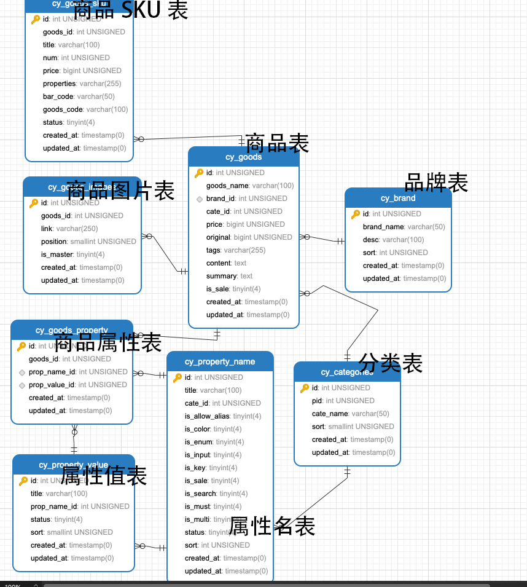


- 完整模型

  

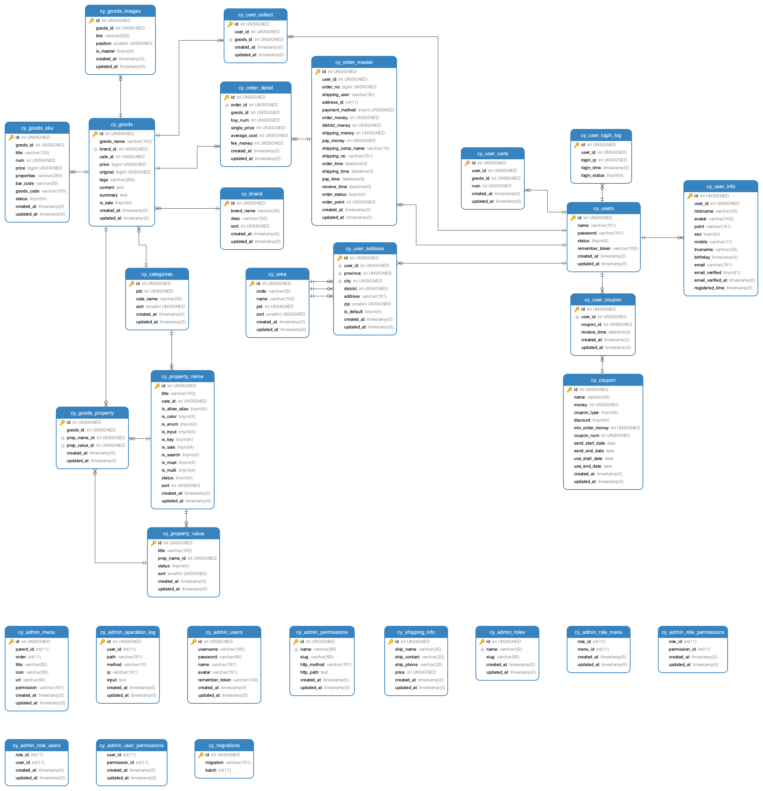


# 代码


- 后台管理使用laravel-admin开发，忽略了表单验证，实际使用需要完善表单验证。
- 接口采用jwt方式在请求中间件中进行认证。
- 文件存储Storage默认替换为了阿里云OSS。
- 去除了Laravel自带的`user`模型和`migration`。
- `config/{app.php, database.config, auth.php}`均有所改动。
- Laravel Auth 的 bcrypt加密方式已替换为MD5加密。
- 采用Services模式和Repository模式组织优雅的项目结构，精简控制器(仅一行代码), 如`UserController`:

```
class UserController extends Controller
{
    public function __construct(UserService $service)
    {
        $this->service = $service;
    }

    /**
     * 用户登录
     * @param LoginRequest $request
     * @return false|string
     */
    public function login(LoginRequest $request)
    {
        return $this->service->login($request->validated());
    }

    /**
     * 用户注册
     * @param RegisterRequest $request
     * @return false|string
     * @throws Exception
     */
    public function register(RegisterRequest $request)
    {
        return $this->service->register($request->validated());
    }

}
```

新手可能会异或UserService是如何注入的，laravel的ioc容器会进行自动注入，实际上laravel ioc容器有个make方法, 递归的通过反射来获取指定类的构造函数，递归基就是到最后没有参数的直接new个实例回去, Service中的Respinsitory注入也是如此。

- Codes目录下定义一些状态码, 利于数据库用数字表示状态的管理，migrations和admin或前台均可以使用，很好的避免代码中出现1,2,3等数字或者在不同的代码中重复定义了相同变量。


## 其他

- Laravel 数据库默认为一主一从的读写分离。
- Session/Cache/Queue默认驱动为Redis。


## 安装

- ```cp .env.examp .env``, 修改.env文件中的配置。
- `php artisan key:generate`创建秘钥。
- `php artisan migrate `创建数据表。
- `php artisan db:seeder AdminTableSeeder`填充权限管理表数据。
- 默认账号:admin, 密码: admin

## 功能

前台接口功能代码仅仅作为个人博客文章演示: `如何优雅的组织laravel项目结构`，所以仅开发了用户模块，后续也不会再进行开发，没有商用价值。

后台功能是学习Laravel-admin插件的使用和设计电商数据库的产物。


## 展示


- 用户列表


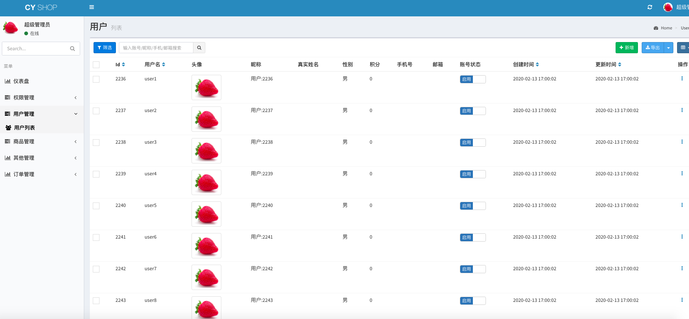


- 分类列表


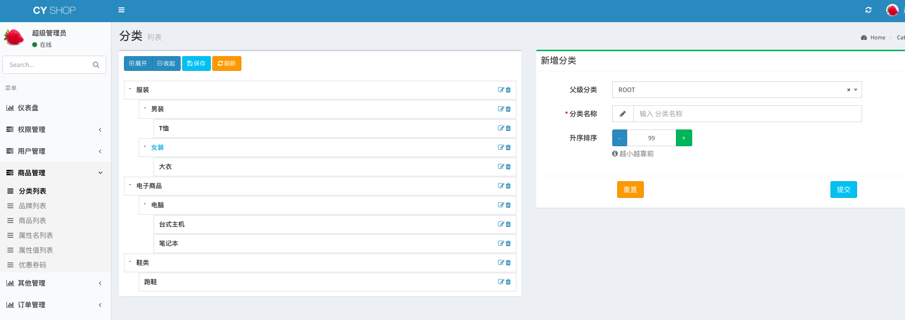


- 品牌列表


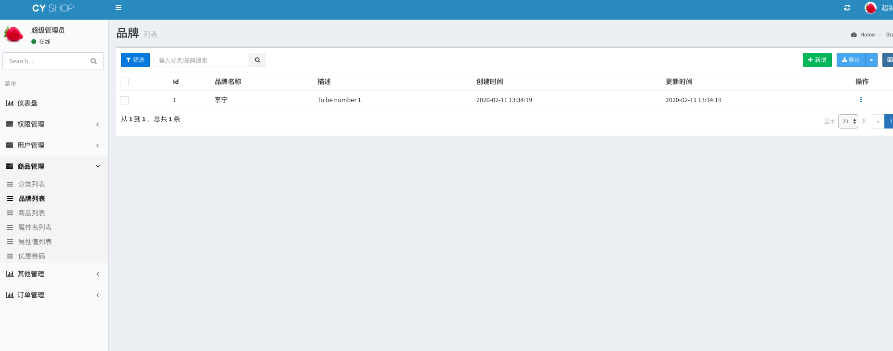

- 商品列表


- 属性名列表

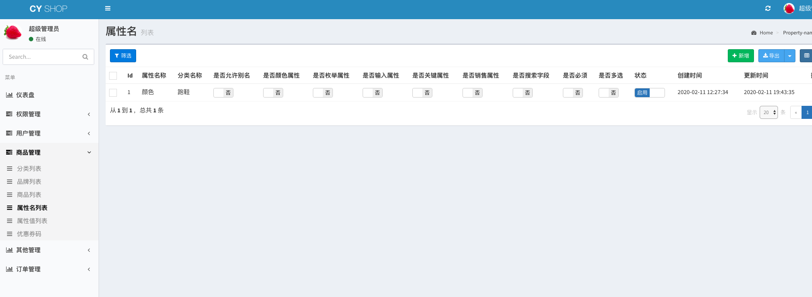


- 属性值表

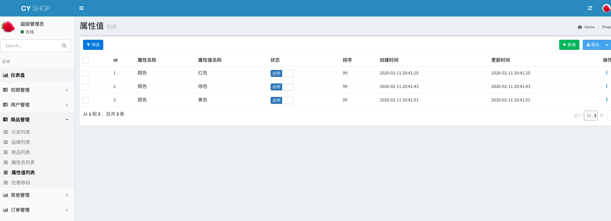

- 优惠券列表

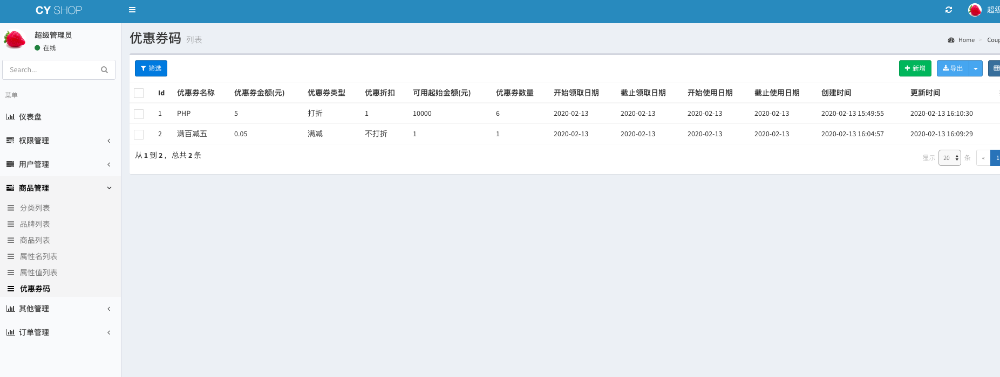

- 地区列表

  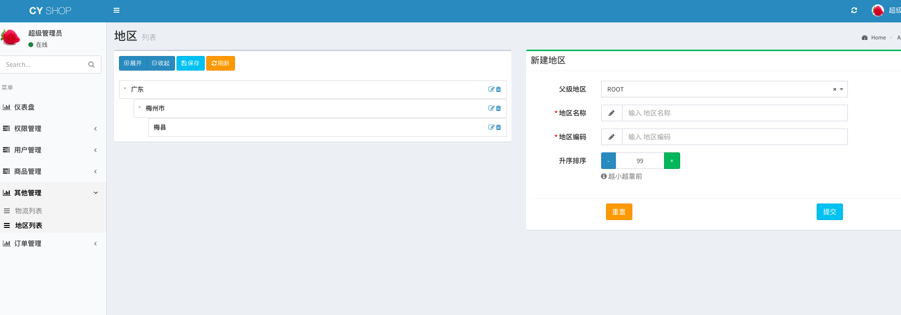

- 物流列表

  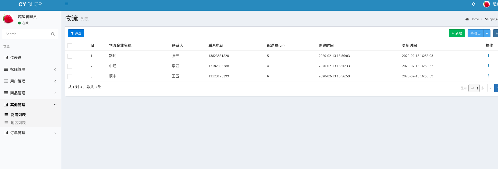

- 订单列表

  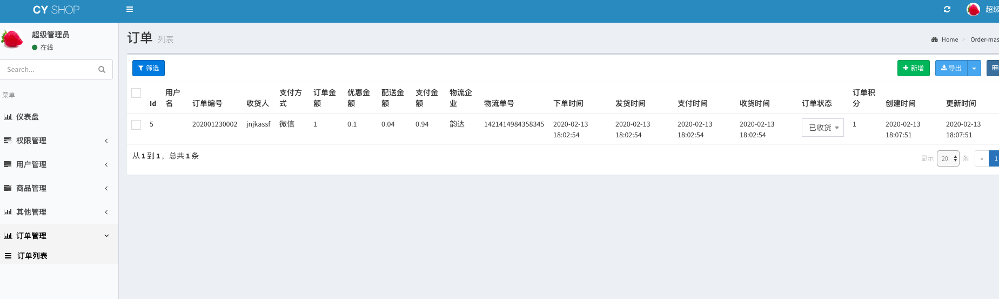

